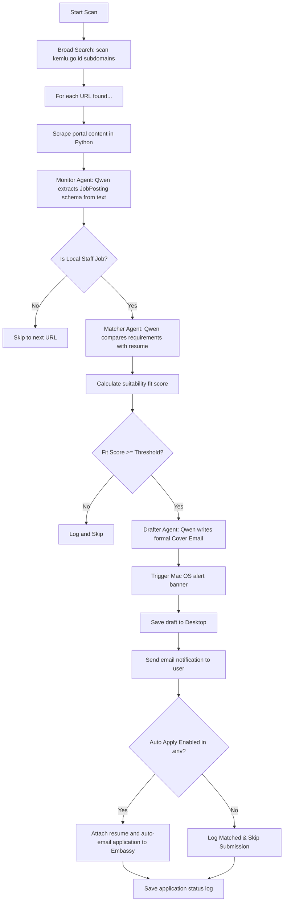

# Diplomatic Career Scout (Indonesian Embassies & Consulates)

An autonomous, multi-agent orchestration workflow that crawls Indonesian Embassy (KBRI) and Consulate (KJRI) job portals globally. It extracts active job postings, matches them against your resume using Qwen (via an OpenAI-compatible interface), alerts you via native macOS notification banners, saves application cover drafts directly to your desktop, and can automatically apply to the target embassy.

---

## 🏗️ Architecture & Component Flow

The orchestrator coordinates three sequential agent roles (Monitor, Matcher, and Drafter). To ensure maximum performance and high reliability with local LLMs, page scraping is executed natively in Python before handing the text content to the agents:



### Worker Agent Roles:
1. **Monitor Agent:** Evaluates raw text scraped from the portals and parses it into a structured schema (`JobPosting`) containing details like job requirements, deadlines, embassy names, and contact/recruitment emails.
2. **Matcher Agent:** Compares the job requirements against your resume text. It calculates a suitability fit score (0-100), extracts three core strengths, lists any missing criteria, and determines if it is a suitable match (threshold 80+ by default).
3. **Drafter Agent:** Formulates a highly polished cover email in Indonesian using diplomatic protocols, incorporating the extracted embassy details and matching strengths.

---

## ⚙️ Configuration Setup

A `.env` file should be located at the root of the project to drive the system. Create a `.env` file based on `.env.example`:

```ini
# LLM Endpoint Configuration (Default configured for local Ollama running Qwen)
LLM_API_KEY=ollama
LLM_BASE_URL=http://localhost:11434/v1
LLM_MODEL=qwen2.5

# Instagram Scraping Session Configuration (Optional, extract 'sessionid' cookie from your browser)
INSTAGRAM_SESSION_ID=your_instagram_session_id_here

# SMTP Server Configuration (configured for local Mailpit container)
SMTP_SERVER=localhost
SMTP_PORT=1025
SMTP_USERNAME=mock
SMTP_PASSWORD=mock
SMTP_USE_TLS=False

# Recipient email for job match alerts (Mailpit captures this, so any email address works!)
NOTIFICATION_RECEIVER=my-alerts@example.com

# Auto Apply Settings
AUTO_APPLY_ENABLED=False
AUTO_APPLY_THRESHOLD=85
```

---

## 🚀 How to Run and Test

### 1. Prerequisite Setup

Make sure you have an OpenAI-compatible API running. If you are running Qwen locally via Ollama, you can automatically install Ollama (via Homebrew) and pull Qwen 2.5 using:
```bash
make ollama-install
```

If you prefer testing emails locally, you can spin up Mailpit using Docker:
```bash
# Build and run local SMTP mock server
make smtp-up
```
* Once active, you can access the Mailpit Web UI at [http://localhost:8025](http://localhost:8025) to view outbound notifications and applications.

### 2. Dependency Installation

Install all required Python libraries:
```bash
make install
```

### 3. Run the Agent Scan

Place your PDF or text resume in the root directory (or update [resume.txt](file:///Users/hafidz/Projects/embassy-consulate-career-scout/resume.txt)).

* **Run global scan with default query:**
  ```bash
  make run
  ```

* **Run a scan with a custom keyword search:**
  ```bash
  make run KEYWORD="KJRI Sydney staf setempat"
  ```

* **Run with a custom resume PDF:**
  ```bash
  make run KEYWORD="staf setempat" RESUME="resume.pdf"
  ```

---

## 📂 Output Outputs

* **Native System Banners:** Suitable roles trigger a native macOS alert banner notifying you of the embassy name and match score.
* **Cover Letter Drafts:** Auto-saved on your Desktop at `~/Desktop/draft_email_<Embassy_Name>.txt`.
* **Outbound Email:** Sent to the configured `NOTIFICATION_RECEIVER` (or auto-submitted to the embassy if `AUTO_APPLY_ENABLED=True`).
* **Execution Logs:** Every scan's results are stored in `applications_log.json` for persistent record-keeping.